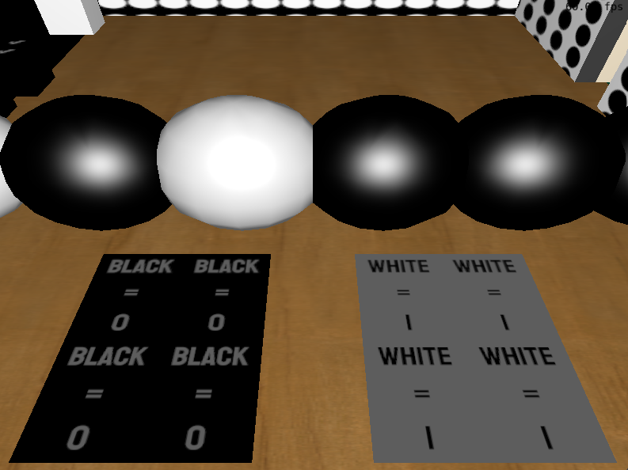
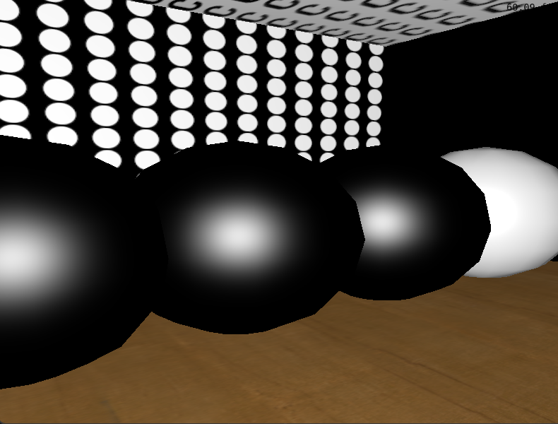
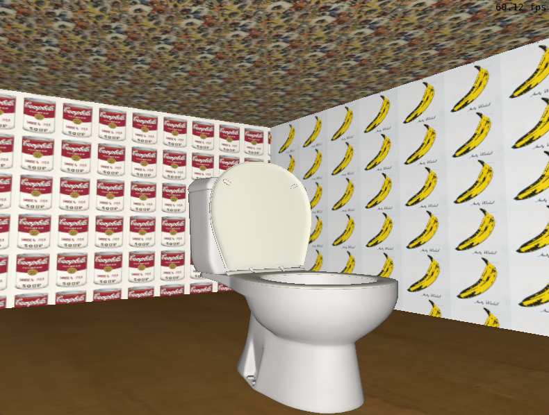

# Relatório de Desenvolvimento

## Contribuições dos Membros da Dupla

- **[Eduarda Tessari Pereira]**: [instâncias de objetos,modelos de iluminação, modelos de interpolação, curva de Bézier.]
- **[João Vítor Schimuneck de Souza]**: [transformações geométricas, colisões, câmera-livre, animações baseadas em tempo]

## Uso de Ferramentas como ChatGPT ou Similares

A dupla utilizou ChatGPT durante o desenvolvimento do trabalho. As principais utilizações foram:

- **Partes auxiliadas**: O ChatGPT foi utilizado principalmente para identificar possíveis erros no código. Além disso, serviu como uma ferramenta para organização e arquitetura do código, auxiliando com sugestões, como a divisão do código em diferentes classes. 
- **Análise crítica**: A ferramenta foi útil para fornecer insights sobre erros em partes do código, sempre acompanhados de explicações sobre o motivo dos erros. Essa dinâmica foi bastante proveitosa, principalmente por não ficarmos estagnados por tanto tempo em um único erro, enquanto também aprendíamos sobre tópicos de computação gráfica que poderiam conter lacunas ou não estarem mais tão frescos em nossas mentes. Isso foi especialmente útil em relação ao OpenGL, que possui uma grande variedade de funções.Em termos de organização de código, a ferramenta também se mostrou bastante didática e apresentou boas ideias. Por outro lado, ela apresentou algumas limitações, como não localizar o erro corretamente ou até mesmo sugerir modificações que, em nosso código, acabavam introduzindo outros erros. Nesses momentos, percebemos que o melhor era parar e analisar o código com calma.
## Desenvolvimento e Uso de Conceitos de Computação Gráfica

Durante o desenvolvimento do trabalho, foram aplicados os seguintes conceitos de Computação Gráfica:

1. **[Malhas poligonais complexas]**: Nosso objeto de maior complexidaade é o **cow.obj**, o qual está instanciado na sala do primeiro puzzle. Outros objetos também foram inseridos no jogo, como cadeiras, uma mesa e uma privada.

2. **[Transformações geométricas controladas pelo usuário]**: A transformação geométrica controlada pelo usuário é uma porta, que começa a rotacionar em torno de seu próprio eixo Y quando o usuário resolve o puzzle da sala correspondente.

3. **[Câmera livre]**: A câmera livre foi adaptada a partir do **Laboratório 2** da disciplina, com alguns ajustes para garantir que o movimento do usuário mantenha o eixo Y fixo. A movimentação é realizada com as teclas **W**, **A**, **S** e **D**.  
4. **[Câmera look-at]**: A câmera look-at também foi adaptada do **Laboratório 2** da disciplina, entretando, ela foi adaptada para ser uma câmera estática (i.e, sem a possibilidade de rotacionar). A câmera é acionada pela tecla **C**.

5. **[Instâncias de objetos]**: Vários objetos foram instanciados múltiplas vezes com texturas diferentes, como as cadeiras na sala do **puzzle 1**, as esferas na sala do puzzle 2 e as paredes.
  
6. **[Colisões]**: Optou-se por criar uma classe separada para agrupar todos os testes de colisão. Os três tipos de teste de colisão implementados foram: **Ponto-AABB**, **Ponto-Esfera** e **Raio-AABB**.

- O teste **Ponto-AABB** é utilizado para as colisões básicas do player com obstáculos, como paredes, cubos e portas.  
 
- O teste **Ponto-Esfera** é utilizado no puzzle 2, para detectar a colisão do player com o bloqueio de esferas.  

- O teste **Raio-AABB** é empregado na interação do player com os objetos. O raio é definido pelo vetor de visão da câmera livre e possui um tamanho máximo fixo, garantindo que o player precise estar suficientemente próximo do objeto para interagir com ele. A interação é realizada pela tecla **E**.
 

Os testes de colisão são realizados com base na posição do player e em um vetor de velocidade. Caso alguma colisão ocorra, o vetor de velocidade é atualizado, garantindo que a posição do jogador seja ajustada corretamente após os testes.  

7. **[Iluminação Difusa]**: A iluminação difusa foi baseada no **Laboratório 4** e utilizou a lei dos cossenos de Lambert para o seu cálculo. Todos os objetos utilizaram desta iluminação (combinada a outra ou apenas ela).
8. **[Iluminação Blinn-Phong]**: A iluminação Blinn-phong foi utilizada em objetos como cadeiras, portas e esferas. Esta iluminação foi combinada ao termo difuso (**lambert_diffuse_term**) para produzir a iluminação final.
 

9. **[Interpolação de Phong]**: Esta interpolação foi utilizada nos mesmos objetos que utilizavam da iluminação de Blinn-Phong. Cada **StaticGameObject** (classe que representa o objeto no jogo) contém um campo em que é possível escolher o tipo de interpolação, podendo ser **PHONG**.
10. **[Interpolação de Gouraud]**: Esta interpolação foi utilizada no obejeto **cow**. Cada **StaticGameObject** (classe que representa o objeto no jogo) contém um campo em que é possível escolher o tipo de interpolação, podendo ser **GOURAUD**. 
11. **[Mapeamento de texturas]**: Havia três tipos de projeção de texturas implementadas para determinar as coordenadas de texturas: esférica, planar e projeção extraída do arquivo .obj. A maoria dos objetos, utilizou a projeção descrita no seu próprio arquivo .obj, enquanto objetos como o quadro e as dicas para o puzzle 2, utilizaram da projeção planar. Nenhum objeto utilizou da projeção esférica. Cada **StaticGameObject** (classe que representa o objeto no jogo) contém um campo que representa o tipo de projeção utilizado pelo objeto, podendo ser SPHERE, PLANE e OBJ_FILE, além de apresentar um campo texture_id, que relaciona o objeto com a textura lida de uma imagem .jpg.

 


12. **[Curva de Bézier cúbica]**: A curva de Bézier foi utilizada na variação da posição do player, a fim de fazer uma introdução em que o player realiza um movimento parabólico. 
13. **[Animações baseadas no tempo]**: Todas as movimentações e rotações no jogo são baseadas no tempo, garantindo que as animações ocorram de maneira uniforme, independentemente da velocidade da máquina que está rodando o jogo.  


O desenvolvimento seguiu as seguintes etapas:

1. Partimos do **Laboratório 4**, que já possuía instâncias de objetos e modelos de iluminação.  
2. Organizamos o código em arquivos e classes separadas.  
3. Integramos a movimentação do **Laboratório 2**.  
4. Aplicamos as texturas com base no **Laboratório 5**.  
5. Implementamos os testes de colisão, curvas de Bézier e refinamos as texturas.  
6. Desenvolvemos a lógica do jogo e a câmera look-at.  
7. Implementamos a rotação controlada pelo usuário (porta).  
8. Realizamos ajustes finais nas texturas e colisões.  

## Imagens da Aplicação

### Sala 1


### Sala 2


### Sala 3



## Manual de Utilização

Para utilizar a aplicação, siga os seguintes atalhos e comandos:

- **[W,A,S,D]**: Movimentação do jogador
- **[E]**: Interação com objetos.
- **[C]**: Câmera look-at

O jogo é baseado em puzzles, e, sempre que um puzzle é resolvido, uma porta se abre, permitindo que o jogador acesse outra sala.  

- **Puzzle 1**: Existem dois cubos — um marcado como **INPUT**, onde o jogador pode inserir a senha, e outro com um **check**, usado para verificar se a senha está correta. A senha deste puzzle é **3**, que corresponde ao grau da curva de Bézier.  
- **Puzzle 2**: Também possui dois cubos com as mesmas funções. Nesse puzzle, o jogador deve pressionar a tecla **C** para ativar uma câmera look-at e visualizar a dica, a qual revela que as esferas na sala representam um número binário. A senha deste puzzle é **5**.  
   
Na última sala, há um vaso sanitário interativo. Ao interagir com ele, todos os objetos da cena são deletados, deixando o jogador em um espaço completamente vazio.

## Mudanças desde a apresentação final

- Adicionamos colisões nas portas, que são removidas assim que o usuário resolve o puzzle da sala correspondente.  
- Adicionamos colisões em mais objetos, incluindo algumas paredes e a vaca (cow.obj).  
- Corrigimos um bug relacionado à colisão **Ponto-Esfera**, no qual o usuário acabava entrando dentro de uma esfera se colidisse com duas ao mesmo tempo.  
- **PLUS**: Adicionamos música ambiente ao jogo.


## Compilação

Siga os passos abaixo para compilar e executar a aplicação:

### Windows com VSCode (Visual Studio Code)

1. **Instale o VSCode**: Siga as instruções disponíveis em [https://code.visualstudio.com/](https://code.visualstudio.com/).  
2. **Instale o compilador GCC**: Configure o GCC no Windows seguindo as instruções em [https://code.visualstudio.com/docs/cpp/config-mingw#_installing-the-mingww64-toolchain](https://code.visualstudio.com/docs/cpp/config-mingw#_installing-the-mingww64-toolchain).  
   - Alternativamente, se você já possui o Code::Blocks instalado (versão que inclui o MinGW), pode usar o GCC que acompanha essa instalação.  
3. **Instale o CMake**: Siga as instruções em [https://cmake.org/download/](https://cmake.org/download/) ou use um package manager como [https://chocolatey.org/](https://chocolatey.org/).  
4. **Instale extensões no VSCode**: Adicione as extensões **ms-vscode.cpptools** e **ms-vscode.cmake-tools**.  
   - Se abrir o diretório do projeto no VSCode, a instalação dessas extensões será sugerida automaticamente (listadas no arquivo `.vscode/extensions.json`).  
5. **Configure o CMake Tools**:  
   - Pressione `Ctrl+Shift+P` no VSCode e busque por **CMake: Open CMake Tools Extension Settings**.  
   - Adicione o caminho do GCC na configuração **additionalCompilerSearchDirs**.  
   - Exemplo: Se estiver usando o GCC que acompanha o Code::Blocks, o caminho pode ser algo como `C:\Program Files\CodeBlocks\MinGW\bin` (verifique o local correto de instalação).  
6. **Compile e execute**: Clique no botão **Play** na barra inferior do VSCode. Na primeira execução, a extensão do CMake solicitará a seleção de um compilador. Escolha o GCC configurado no passo anterior.  

Para mais detalhes sobre o uso do CMake no VSCode, consulte:  
[https://github.com/microsoft/vscode-cmake-tools/blob/main/docs/README.md](https://github.com/microsoft/vscode-cmake-tools/blob/main/docs/README.md)

---

### Linux com CMake

1. Abra um terminal e navegue até a pasta do projeto  
2. Execute os comandos abaixo:  
   ```bash
   mkdir build  # Cria o diretório de build
   cd build     # Acessa o diretório
   cmake ..     # Configura o projeto com o CMake
   make         # Realiza a compilação
   make run     # Executa o código compilado

### Linux com VSCode

1. **Instale o VSCode**: Siga as instruções disponíveis em [https://code.visualstudio.com/](https://code.visualstudio.com/).  
2. **Instale as extensões necessárias**: Adicione as extensões **ms-vscode.cpptools** e **ms-vscode.cmake-tools**.  
   - Ao abrir o diretório do projeto no VSCode, a instalação dessas extensões será sugerida automaticamente (listadas no arquivo `.vscode/extensions.json`).  
3. **Compile e execute o projeto**:  
   - Clique no botão **Play** na barra inferior do VSCode para compilar e executar o projeto.  
   - Na primeira execução, a extensão do CMake solicitará que você selecione um compilador. Escolha o compilador configurado no seu sistema.  

---
**Observação**: Caso tenha dúvidas ou problemas na execução, entre em contato com os desenvolvedores.


